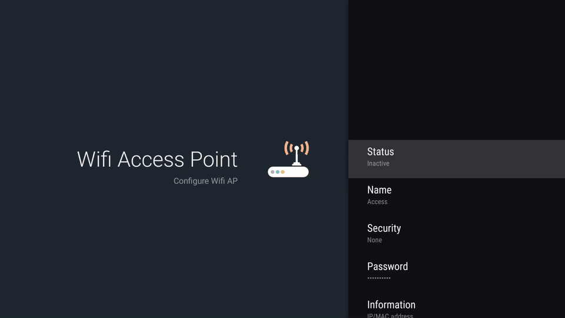

# Wifi AP configuration for Android TV #

[](LICENSE.md)

An Android TV application used to configure your Wifi Access Point



## Requirements

Android TV 5.0 (sdk 21) or Android TV 5.1.1 (sdk 22)

## Pros & Cons

Pros :
* address the lack of Wifi AP configuration in Google TV Settings
* built with Google Leanback framework
* interface very similar to Google TvSettings

Cons :
* uses private APIs that may not be available on devices
* doesnt work on some devices (see incompatible device list)
* doesnt work on Android M due to `android.provider.Settings.ACTION_MANAGE_WRITE_SETTINGS` intent which is required to be exposed by a System Activity. On Android TV, Google `Settings` applications is not installed, only `TvSettings` application is installed which doesnt have this intent

## Compatible devices

* Bbox Miami

## Incompatible devices

* Sony Bravia 4K

There seems to have a System service restarting Wifi automatically every second preventing AP to setup :
```
I/BluetoothResetService_v3.11: check wifi and bt status
I/BluetoothResetService_v3.11: checkWifiBtStatus
E/BluetoothResetService_nat_v1.8: run ioctl  fail : Network is down (100)
I/BluetoothResetService_nat_v1.8: bt driver status = 1, if reture 0, bt framework need reset
I/BluetoothResetService_v3.11: bt and wifi Status is normal, nothing to do
```

* Philips 32PFH5500

We have an error coming from AP configuration at `netd` level on this device :
```
E/WifiStateMachine: Exception in softap start java.lang.IllegalArgumentException: command '50 softap fwreload wlan0 AP' failed with '501 50 SoftAP command has failed'
E/WifiStateMachine: Exception in softap re-start java.lang.IllegalArgumentException: command '52 softap fwreload wlan0 STA' failed with '501 52 SoftAP command has failed'
```

## Not tested

* Nexus Player
* Nvida Shield

## External Lib

* `accesspoint` library by Daniel Martí from https://github.com/mvdan/accesspoint for managing access point and retrieving connected client
* `leanback-v17` with some example provided here : https://github.com/googlesamples/androidtv-Leanback and https://github.com/stari4ek/androidtv-Leanback

## License

The MIT License (MIT) Copyright (c) 2016 Bertrand Martel